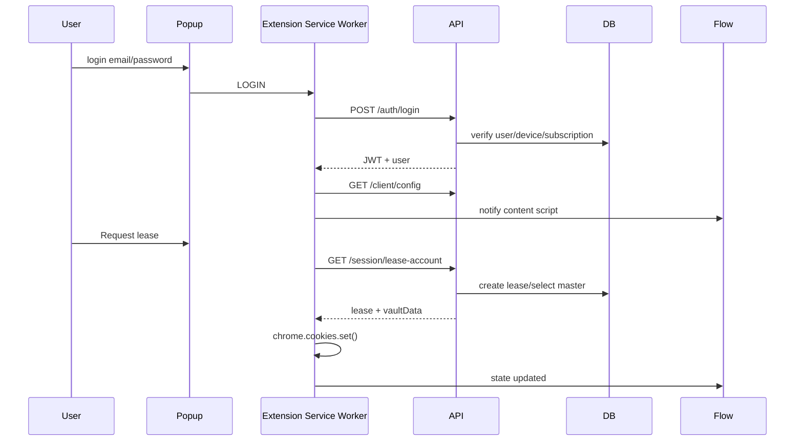
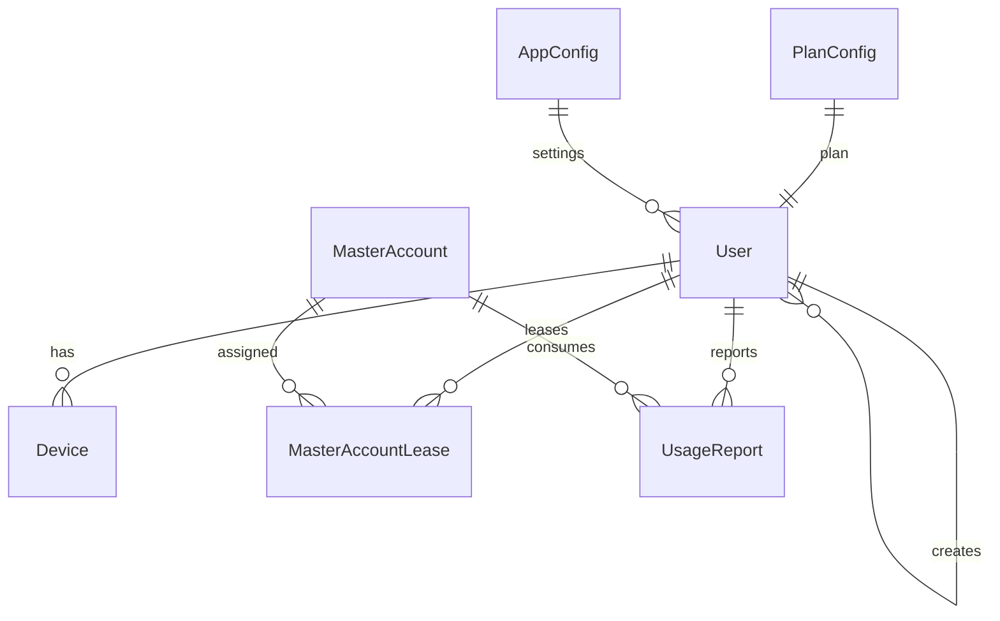
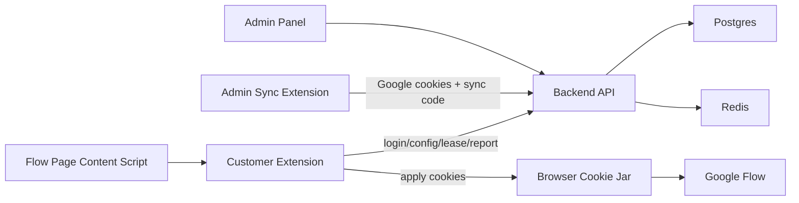
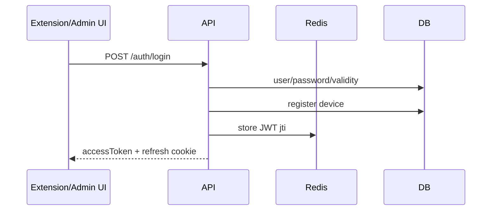
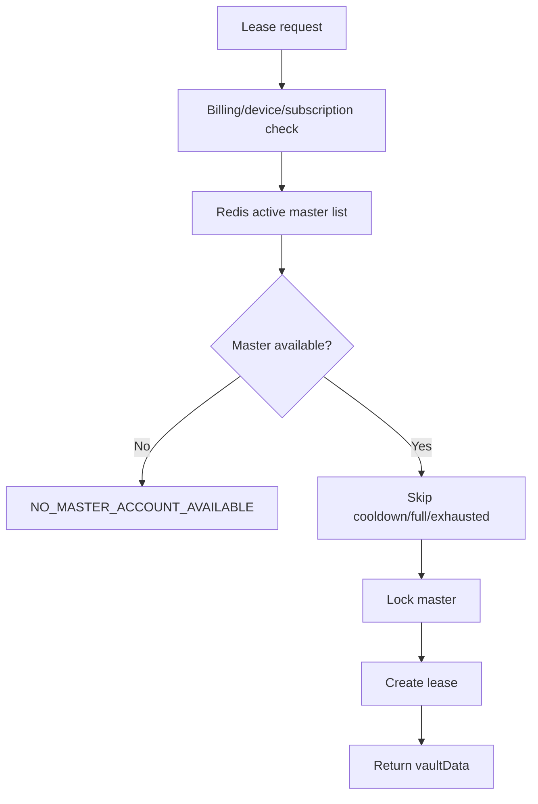
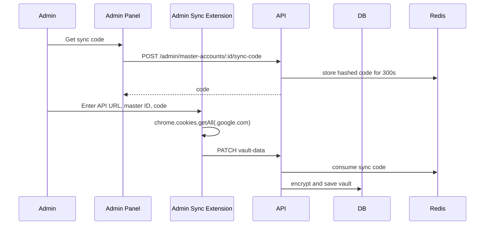

# Vidgen Flow Technical Audit

## 1. Executive Summary

This project is a managed "Vidgen Flow session licensing" SaaS. Its business purpose is to let customers access a controlled Flow workflow through virtual credentials and a Chrome extension, while admins manage users, plans, credits, account validity, master accounts, and session leasing from a backend/admin panel.

Architecture:

- Fastify backend API
- PostgreSQL via Prisma
- Redis for hot-path state, token/session/cache, round-robin and lease data
- Next.js landing website and admin panel
- Customer Chrome extension
- Admin cookie-sync Chrome extension
- PM2/Nginx deployment scripts

Evidence:

- `README.md`
- `package.json`
- `src/app.ts`
- `prisma/schema.prisma`

Confidence: High.

## 2. Project Structure Analysis

```text
E:/flow 3
├─ src/                       Backend source
│  ├─ modules/auth            Login, JWT, refresh
│  ├─ modules/admin           Admin panel APIs
│  ├─ modules/client          Client config/dashboard
│  ├─ modules/sessions        Lease/release/report APIs
│  ├─ modules/master-accounts Pool + round robin
│  ├─ modules/usage           Usage reports/cooldown/idempotency
│  ├─ modules/devices         Device registration/limit
│  └─ config/plugins/utils    Env, crypto, Redis, Prisma, JWT
├─ prisma/                    Database schema/migrations/seed
├─ extension/                 Customer Vidgen Flow extension
├─ admin-sync-extension/      Super-admin cookie vault sync extension
├─ landing/                   Next.js website + admin UI
├─ deploy/                    VPS/Nginx/SSL/deploy scripts
├─ tests/                     Vitest backend tests
└─ scripts/                   Build, Redis check, cleanup
```

Importance:

- Critical: `src`, `prisma`, `extension`, `admin-sync-extension`, `landing/src/components/AdminPanel.tsx`
- Operational: `deploy`, `ecosystem.config.cjs`, `.env`
- Supporting: assets, logs, generated zips

## 3. Authentication & Authorization

Login flow:

1. Extension or admin panel sends email/password.
2. Backend validates allowed domain, password, subscription validity, and device.
3. Backend issues access token plus refresh cookie.
4. JWT includes userId, fingerprintId, role, plan, validity, and configHash.
5. Redis stores JWT `jti`; revoked or missing tokens fail authentication.

Authorization model:

- `SUPER_ADMIN`: full admin, master accounts, plan/app config, admins.
- `ADMIN`: generate and manage own customers.
- `CUSTOMER`: extension access and session leasing.

Customer emails must be system-generated virtual emails like `user_xxx@vidgen.fun`.

Evidence:

- `src/modules/auth/auth.routes.ts`
- `src/modules/auth/auth.service.ts`
- `src/config/env.ts`
- `src/modules/devices/device.service.ts`

Confidence: High.

## 4. Session Management Investigation

There are two session types.

### Backend Auth Session

- JWT access token stored by extension/admin UI.
- Refresh token stored as HttpOnly cookie.
- Redis validates JWT lifecycle.

### Master Account Lease Session

- Created by `GET /session/lease-account`.
- Stored in DB table `MasterAccountLease`.
- Cached in Redis as `lease:{leaseId}`.
- TTL default is `LEASE_TTL_SECONDS=150`.
- Extension stores active lease in `chrome.storage.session`.

Conclusions:

- Accounts are pooled: Yes. Confidence High.
- Accounts are recycled: Yes, after release, expiry, or cooldown. Confidence High.
- Accounts are dedicated per user: No. Confidence High.
- Sessions are shared indirectly through master cookie vault: Yes. Confidence High.
- True browser isolation/proxy affinity: Not proven in code. Confidence High.

Evidence:

- `src/modules/master-accounts/master-account.service.ts`
- `src/modules/sessions/session.routes.ts`
- `src/modules/master-accounts/round-robin.service.ts`

## 5. Chrome Extension Forensics

## Customer Extension: Vidgen Flow

Path: `extension/`

Manifest V3 extension with:

- Background service worker
- Popup UI
- Flow page content script
- Cookie permission
- Storage permission
- Tabs/scripting permissions

Storage:

- `chrome.storage.session`: access token, user, config, dashboard, activeLease
- `chrome.storage.local`: API base URL, fingerprint ID

Cookie behavior:

- Receives `vaultData` from backend lease response.
- Parses cookie JSON.
- Applies cookies with `chrome.cookies.set()`.
- Removes cookies with `chrome.cookies.remove()` on wipe/release flows.

Evidence:

- `extension/manifest.json`
- `extension/background/service-worker.js`
- `extension/popup/popup.js`
- `extension/content/flow-gate.js`

## Admin Sync Extension

Path: `admin-sync-extension/`

Purpose:

- Used only by super admin.
- Reads logged-in `.google.com` cookies from admin's Chrome profile.
- Sends cookies to backend vault using Master Account ID and temporary sync code.

Flow:

1. Admin logs into target Google master account in Chrome.
2. Admin gets Master Account ID from admin panel.
3. Admin generates sync code from admin panel.
4. Admin sync extension reads cookies:
   `chrome.cookies.getAll({ domain: ".google.com" })`
5. Extension sends:
   `PATCH /admin/master-accounts/:id/vault-data`
6. Backend validates sync code and encrypts cookie payload.

Evidence:

- `admin-sync-extension/manifest.json`
- `admin-sync-extension/popup.js`

Sequence:



## 6. API Reverse Engineering

Public:

- `GET /health`

Auth:

- `POST /auth/login`
- `POST /auth/refresh`
- `POST /auth/logout`

Client:

- `GET /client/config`
- `GET /client/dashboard`

Session:

- `GET /session/lease-account`
- `POST /session/release-usage`
- `POST /session/report-usage`

Admin:

- `POST /admin/create-admin`
- `POST /admin/generate-user`
- `GET /admin/generated-user-settings`
- `PUT /admin/generated-user-settings`
- `PATCH /admin/users/:id/plan`
- `GET /admin/admins`
- `PATCH /admin/admins/:id/status`
- `GET /admin/sales-report`
- `POST /admin/plan-config`
- `POST /admin/app-config`
- `GET /admin/master-accounts`
- `POST /admin/master-accounts`
- `POST /admin/master-accounts/:id/sync-code`
- `PATCH /admin/master-accounts/:id/vault-data`
- `GET /admin/analytics`
- `GET /admin/users/active`
- `GET /admin/users/expired`
- `GET /admin/users/pending-manual`
- `POST /admin/user/toggle-status/:userId`
- `DELETE /admin/users/:userId`

Evidence:

- `src/modules/admin/admin.routes.ts`
- `src/modules/sessions/session.schemas.ts`
- `src/modules/admin/admin.schemas.ts`
- `src/modules/client/client.routes.ts`

## 7. Database Reconstruction

Main models:

- `User`: admin/customer, plan, validity, credits
- `Device`: user device fingerprints
- `MasterAccount`: pooled provider accounts and encrypted cookies
- `MasterAccountLease`: active/completed/expired leases
- `UsageReport`: generation outcomes
- `PlanConfig`: plan credits/pricing/duration
- `AppConfig`: global settings

Evidence: `prisma/schema.prisma`



## 8. Credit Tracking System

Credits are assigned when admin generates a user.

Plan defaults:

- BASIC: 20
- PRO: 100
- ULTRA: 500

Credits are consumed when `POST /session/report-usage` reports `SUCCESS`.

Backend behavior:

- User `creditsUsed` increments by 1.
- Master account `remainingLimit` decrements by `usageUnits`.
- Duplicate usage reports are ignored through lease-level idempotency.

Evidence:

- `src/modules/admin/admin.service.ts`
- `src/modules/billing/billing.service.ts`
- `src/modules/usage/usage.service.ts`

Confidence: High.

## 9. Account Distribution System

Master account storage:

- DB: `MasterAccount`
- Encrypted session material: `encryptedCookie` + `cookieNonce`
- Redis active list: `master:active:list`
- Redis round-robin index: `master:rr:index`
- Redis inflight jobs: `master:{id}:inflight_jobs`

Selection:

- Round robin selects next active master.
- Skips cooldown/full/inactive accounts.
- Uses a Redis lock per master.
- Default inflight capacity is 20.

Reuse:

- Submitted leases buffer master lock for 1 second.
- Inflight job remains tracked until usage report or expiry.
- Repeated transient failures cause cooldown up to 60 seconds.

Conclusion:

- Multiple users can use one master account, up to the configured inflight capacity. Confidence High.

Evidence:

- `src/modules/master-accounts/round-robin.service.ts`
- `src/modules/usage/usage.service.ts`

## 10. Security Analysis

High severity:

- Master account cookies are distributed to the customer browser extension during lease. Cookies are encrypted at rest, but decrypted `vaultData` reaches the client extension.
- Admin sync extension reads broad `.google.com` cookies.

Medium severity:

- Flow page DOM locking is fragile because external UI can change.
- `declarativeNetRequest` rules named `stealth_rules` exist; header manipulation can introduce mismatch/risk.
- No proven browser profile isolation/proxy affinity/session sandboxing.

Low or controlled:

- JWT Redis tracking exists.
- Argon2 password hashing exists.
- Helmet/CORS/rate limit exist.
- Device limit exists.
- Sync code expires after 300 seconds.

Evidence:

- `extension/manifest.json`
- `extension/background/service-worker.js`
- `admin-sync-extension/popup.js`
- `src/modules/master-accounts/master-account.service.ts`

## 11. Complete Data Flow



End-to-end:

1. Super admin creates admin/customer users.
2. Admin creates virtual customer credentials.
3. Customer logs into extension.
4. Extension fetches client config/dashboard.
5. Customer requests lease.
6. Backend selects master from pool.
7. Backend returns lease metadata and vaultData.
8. Extension applies cookies.
9. Content script enforces plan/policy UI gates.
10. User starts generation.
11. Extension releases/reports usage.
12. Backend updates user credits, master remaining limit, usage reports, cooldowns.

## 12. Hidden Features Discovery

Found:

- `extension/content/feature-gate.js` appears to be an alternate or older gating file.
- Many historical extension ZIPs exist in `landing/public/downloads`.
- `preview-extension-and-portal.html` is a local preview artifact.
- `extension/_metadata/generated_indexed_rulesets/_ruleset1` is generated browser metadata and should not be included in packaged extension.
- `ruleset.json` / `stealth_rules` is sensitive/experimental-looking.

Confidence: Medium.

## 13. Architecture Diagrams

Authentication:



Account allocation:



Admin sync:



## 14. Missing Components Analysis

Present but partial:

- Video history/dashboard: partial usage history, not real downloadable video archive.
- Smooth auto lease renewal/pre-warm: partial.
- Extension DOM locks: partial and fragile.
- Production observability: basic logs, no full metrics/tracing dashboard seen.
- Master health scoring: partial cooldown/exhausted/auth invalid.

Missing:

- Browser/profile isolation.
- Proxy/IP affinity.
- Server-side session proxying where provider session material never reaches customer browser.
- Automated E2E browser tests against live Flow.
- Enterprise audit logs.
- Formal event monitoring/alerting.

## 15. Competitive Comparison Checklist

```text
Session Management          Present
Account Pooling             Present
Account Rotation            Present
Per-master Capacity         Present
Credit Tracking             Present
Idempotent Usage Reports    Present
Device Limit                Present
Admin/Reseller Controls     Present
Cookie Vault Encryption     Present
Cookie Sync Extension       Present
Browser Isolation           Missing
Proxy/IP Affinity           Missing
Robust Video History        Partial/Missing
DOM Feature Locking         Partial
Observability/Monitoring    Partial
Enterprise Audit Logs       Missing
```

## 16. Final Verdict

This system is a working managed-session licensing MVP/SaaS prototype. It has a real backend architecture, user/admin roles, virtual credentials, device controls, master account pool, encrypted cookie vault, Redis leasing, usage reporting, and admin UI.

Maturity: Medium.

Backend core is stronger than the browser/session side.

Likely missing for enterprise grade:

- Safer architecture where provider session material does not go to customer browsers.
- Browser/profile isolation strategy.
- Durable video history.
- Robust monitoring/audit logs.
- Formal master account health automation.
- Stronger package/release hygiene for extension ZIPs.
- More E2E tests across extension and Flow page.

## Test Result

Command:

```bash
npm test
```

Result:

```text
8 test files passed
38 tests passed
```

